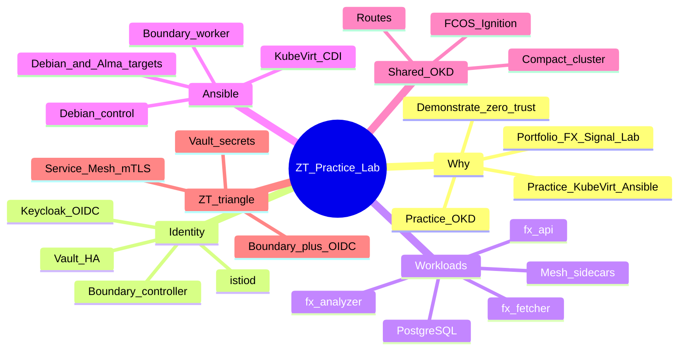
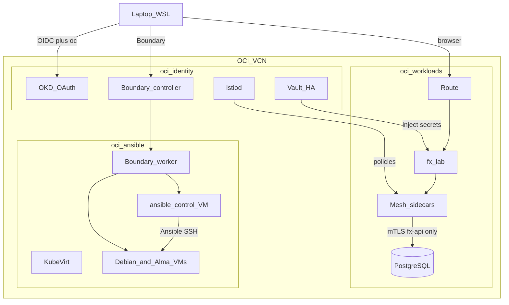
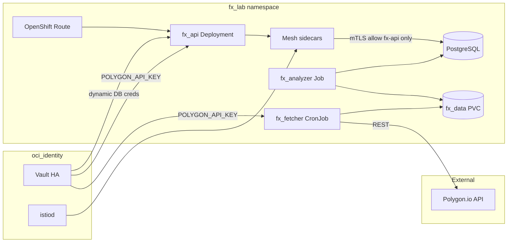
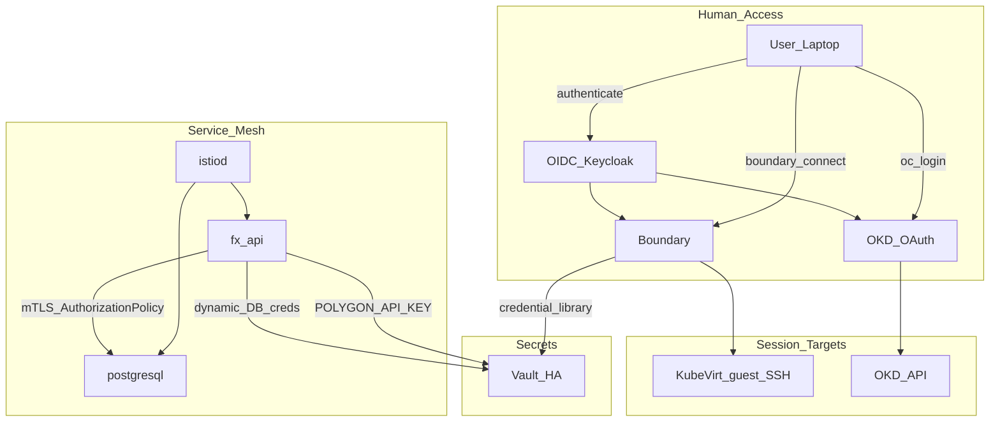
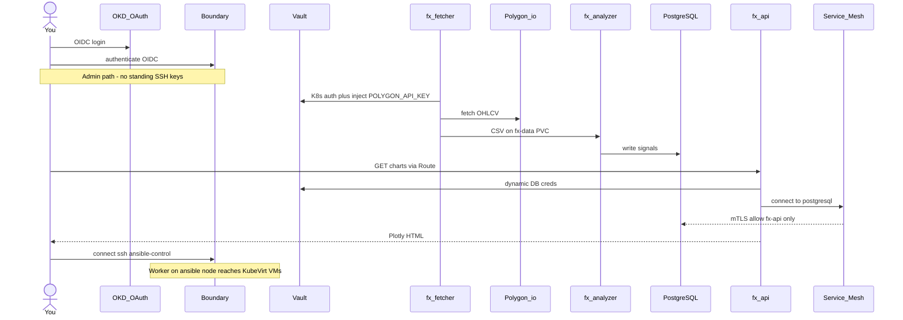
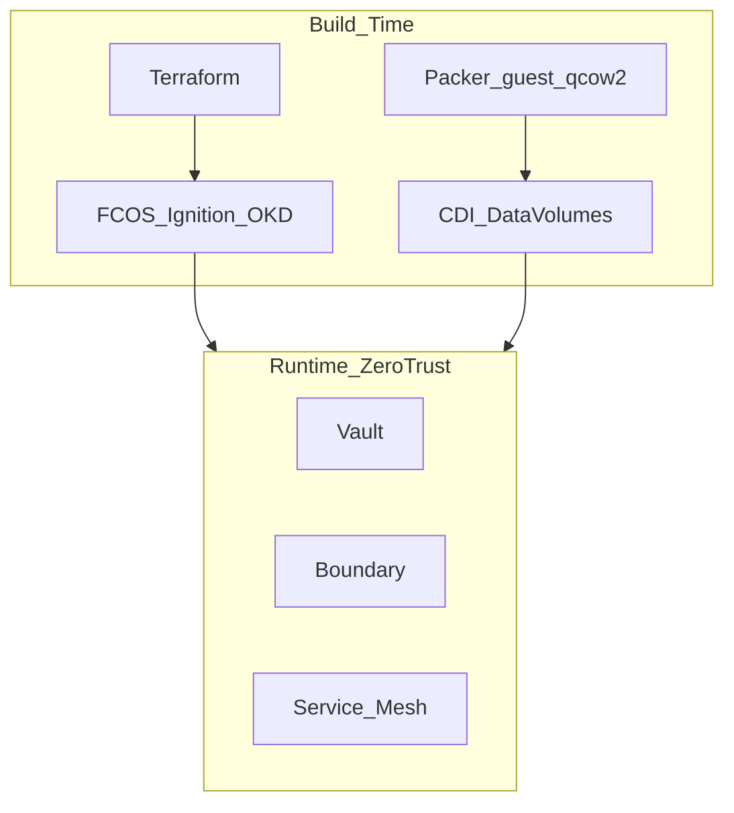
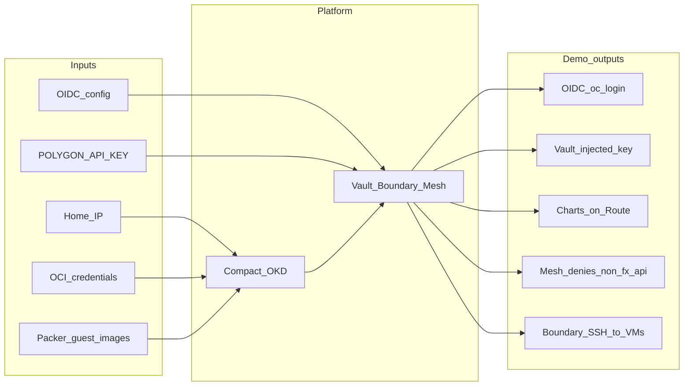

# Zero-Trust Practice Lab — Portfolio Overview

I am building a three-node zero-trust lab on Oracle Cloud Infrastructure as a **compact OKD cluster** (the open-source distribution that underlies Red Hat OpenShift). Identity, workloads, and Ansible planes live on separate nodes with pinned namespaces. **FX Signal Lab** is the flagship app: a CronJob pulls forex data using a Vault-injected API key, a batch Job computes VSA and Bollinger signals, PostgreSQL stores history, and FastAPI serves charts behind an OpenShift Route. Cluster admin uses OIDC; SSH to Ansible VMs is Boundary-brokered; east-west traffic uses Service Mesh mTLS. Instances stop when I am not practicing to control cost.

This is a **target-state design** for a personal lab — not a production environment. Implementation detail lives in [`vps_oci_3node_lab_okd_kubevirt_architecture-v1.md`](vps_oci_3node_lab_okd_kubevirt_architecture-v1.md).

## Skills this lab demonstrates

- **OKD / OpenShift** — compact three-node cluster, Routes, OAuth, Operators, CRI-O
- **KubeVirt + CDI** — real guest OS VMs (Debian 12 and AlmaLinux 9) for Ansible practice
- **HashiCorp stack** — Terraform (`oci` provider), Vault HA, Boundary, Packer guest images
- **Ansible** — heterogeneous Linux fleet on KubeVirt, not containers pretending to be VMs
- **Zero-trust patterns** — OIDC for humans, Vault for secrets, Service Mesh mTLS for services
- **Application platform** — Python/FastAPI pipeline with CronJobs, Jobs, PVCs, and an external API

## Platform at a glance

Three AMD x86 `VM.Standard.E4.Flex` instances (4 OCPU / 32 GB / 200 GB each) in one OCI VCN form a single compact OKD cluster. Control-plane components run on all three nodes; **user** workloads are pinned with `lab.plane=identity|workloads|ansible`.

| Plane | Node | Role |
| ----- | ---- | ---- |
| **Identity & trust** | `oci-identity` | Secrets, identity, and mesh control — Vault, Boundary controller, Keycloak (OIDC), istiod |
| **Applications** | `oci-workloads` | FX Signal Lab — fetcher, analyzer, API, PostgreSQL, mesh sidecars |
| **Automation fleet** | `oci-ansible` | KubeVirt guests (Debian control + Debian/Alma targets) and a Boundary worker |

This split mirrors production thinking: security-critical services stay off the application blast radius, and the Ansible practice fleet stays off application pods.

## Mindmap

## Topology

North-south: my laptop authenticates to **OKD OAuth** (OIDC) for cluster admin and to **Boundary** for SSH into KubeVirt guests. FX Signal Lab is reached via an OpenShift Route. Public SSH is closed; API, OAuth, and Boundary are limited to a home IP.

East-west: FX pods pull secrets from Vault on the identity node over the private VCN. Mesh policies on identity apply to sidecars on workloads. Ansible SSH never crosses into `fx-lab` — guests are scheduled only on the ansible node.

Build-time: Terraform provisions the three instances and VCN. OKD installs on Fedora CoreOS via Ignition. Packer builds guest disks that CDI/KubeVirt consumes.

## FX Signal Lab

A bounded forex analytics platform — not a throwaway nginx demo. It shows batch processing, persistent data, external API integration, and zero-trust secret handling on OKD.

| Component | Kind | Responsibility |
| --------- | ---- | -------------- |
| **fx-fetcher** | CronJob | Pull 30-minute OHLCV bars from Polygon.io onto a shared PVC |
| **fx-analyzer** | Job | Volume Spread Analysis and Bollinger Band signals → PostgreSQL and Plotly charts |
| **fx-api** | Deployment | FastAPI — health, signals, and charts |
| **postgresql** | StatefulSet | Signal history |
| **Route** | OpenShift Route | `fx.<lab-domain>` → `fx-api` |

## Zero-trust model

Vault governs *what credentials exist*. Boundary plus OKD OAuth govern *who may access what*. The mesh governs *which services may communicate*.

| Pillar | Product | Lab implementation |
| ------ | ------- | ------------------ |
| **Verify explicitly** | OKD OAuth + Boundary + OIDC | Every admin session authenticated; no anonymous SSH |
| **Least privilege** | RBAC / SCC + Boundary + Vault | Scoped targets; ephemeral SSH credentials from Vault |
| **Assume breach** | Segregated planes | Vault on identity; apps on workloads; Ansible VMs on ansible |
| **Micro-segmentation** | OpenShift Service Mesh | mTLS between `fx-api` and PostgreSQL; default-deny policies |
| **Secrets** | Vault HA | API key and dynamic DB credentials — never in git |
| **Edge** | OCI NSGs | API / OAuth / Boundary from home IP only; public SSH denied |

Interview walkthrough: authenticate once, then secrets and service identity do the rest.

## How it is built

| Stage | Tool | Delivers |
| ----- | ---- | -------- |
| **Infrastructure** | Terraform | Three Flex instances, VCN, NSGs |
| **Cluster** | OKD + Ignition | Compact three-node Fedora CoreOS cluster |
| **Guest images** | Packer | Debian 12 and AlmaLinux 9 qcow2 → CDI |
| **Configuration** | Operators / Helm / Ansible | Vault, Boundary, mesh, `fx-lab`, KubeVirt VMs |

## Inputs to outcomes

What has to exist, and what I can show.

## Technology stack

| Technology | Where | What it shows |
| ---------- | ----- | ------------- |
| **OKD** | All three nodes | Compact cluster, Routes, OAuth, Operators |
| **FX Signal Lab** | Workloads hub | CronJobs, Jobs, FastAPI, PostgreSQL, Polygon.io |
| **KubeVirt / CDI** | Ansible hub | Debian + AlmaLinux Ansible fleet |
| **Vault** | Identity hub | HA, Kubernetes auth, dynamic DB credentials |
| **Boundary** | Controller on identity; worker on ansible | Identity-brokered SSH — no standing host keys |
| **Service Mesh** | istiod on identity; sidecars on workloads | mTLS between `fx-api` and PostgreSQL |
| **Terraform** | Identity plane | Instances, VCN, NSGs |
| **Packer** | Laptop | Guest qcow2 for KubeVirt |
| **Ansible** | KubeVirt VMs | Heterogeneous `apt` vs `dnf` automation |

## Honest constraints

- **Paid x86 Flex, not Always Free Ampere.** Compact OKD needs comparable RAM on every node; ARM Always Free shapes are out of scope.
- **etcd spans all three nodes.** Plane isolation is for *user* workloads. Losing any node still affects control-plane quorum.
- **Stop-when-idle.** Compute bills while instances run; block volumes bill always-on. Cold start after stop is slower than a Kind lab.
- **Nested KVM.** KubeVirt needs hardware virtualization on the ansible node; emulation is not the daily path.
