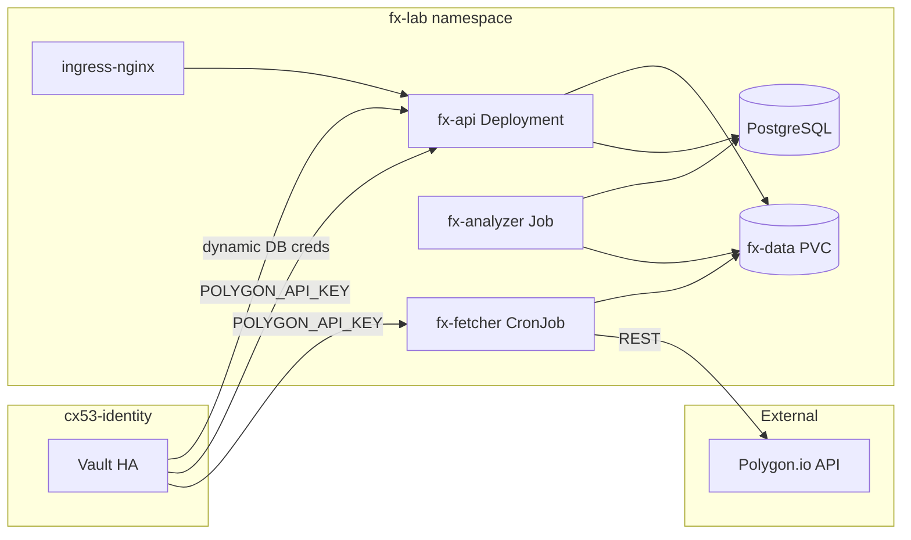
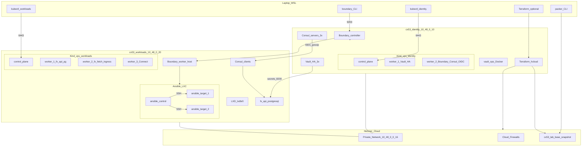
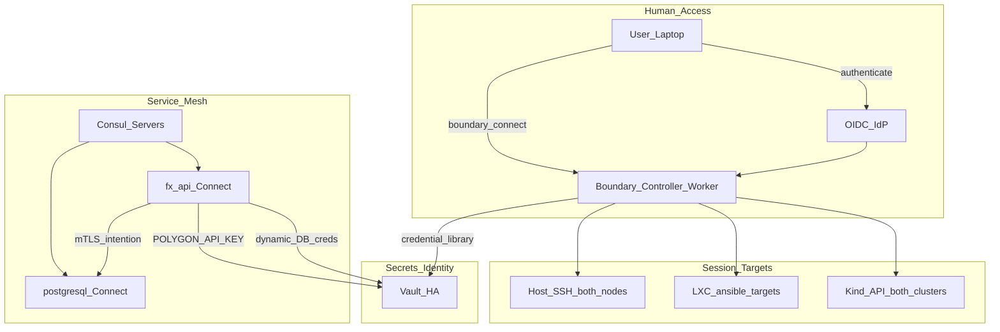
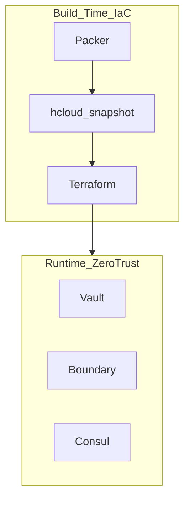
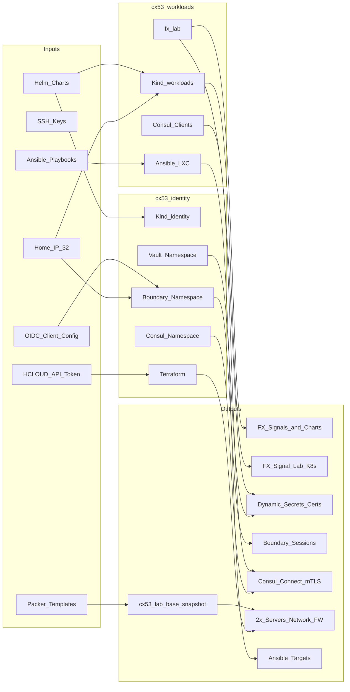

# VPS DevOps Practice Lab — Architecture

This document is the architectural design for a **dual-node Hetzner Cloud practice lab** — a hands-on platform for **Ansible**, **Kubernetes (Kind)**, **HashiCorp Terraform**, **HashiCorp Vault**, **HashiCorp Boundary**, **HashiCorp Consul**, and **HashiCorp Packer**, with a **zero-trust** capability layer and an **immutable infrastructure** pipeline.

The lab's flagship application is **FX Signal Lab** — a forex technical-analysis platform that fetches market data from Polygon.io, runs Volume Spread Analysis (VSA) and Bollinger Band signal logic, persists results, and serves interactive charts via a containerized API behind Ingress.

The lab splits workloads across **two identical CX53 servers** connected via a Hetzner private network. This document describes the **target-state architecture** for the project.


| Attribute                  | Value                 |
| -------------------------- | --------------------- |
| **Document version**       | v1.1                  |
| **Status**                 | Target-state design   |
| **Infrastructure**         | 2× Hetzner Cloud CX53 |
| **Flagship application**   | FX Signal Lab         |
| **Monthly cost (approx.)** | ~$49.00 USD               |


---


## How to Read This Document


| Audience                           | Recommended sections                                                                                                                                                                   |
| ---------------------------------- | -------------------------------------------------------------------------------------------------------------------------------------------------------------------------------------- |
| **Senior management**              | Executive Summary, Business Objectives, FX Signal Lab, Solution Overview, Cost and Capacity, Risks and Trade-offs, Decision Record, Zero-Trust Model, Technology Alignment, Architecture Summary |
| **Solution / security architects** | Design Principles, Architecture Topology, Zero-Trust Model, Network and Security, Cross-VPS Integration (Section 13.5 Golden Image Pipeline), Inputs and Outputs |
| **Implementation engineers**       | Host Specifications, Kind Cluster Specifications, FX Signal Lab (`fx-lab` namespace), Cross-VPS Integration, Section 13.5, LXC Layer, Client Tooling, Resource Budgets, Bootstrap Order (Phase 0), Ansible Inventory, Component Summary |


Sections marked **At a glance** provide a one-sentence summary for readers who do not need full technical detail.

---


# Part A — Executive and Strategic


## Executive Summary

The VPS DevOps Practice Lab is a self-hosted training platform built on Hetzner Cloud. It supports hands-on practice with Ansible, Kubernetes, HashiCorp Terraform, HashiCorp Vault, HashiCorp Boundary, HashiCorp Consul, and HashiCorp Packer while demonstrating modern **zero-trust** architectural patterns suitable for portfolio and interview discussion.

The lab's **flagship workload** is **FX Signal Lab** — a production-style forex analytics pipeline deployed on the workloads hub. Scheduled jobs fetch 30-minute OHLCV bars from Polygon.io, a batch analyzer computes VSA and Bollinger Band breakout signals, results land on persistent storage and PostgreSQL, and a FastAPI service exposes signals and Plotly charts behind ingress-nginx. The Polygon API key is injected from Vault on the identity hub — never stored in git or plain ConfigMaps.

This design deploys **two identical CX53 virtual servers** (~$24.50 USD/month each, ~$49 USD/month combined) in the same Hetzner region, connected by a **private network**. One server hosts the **identity and trust plane** (secrets, privileged access, service identity); the other hosts **applications and automation** (Kubernetes workloads, Ansible targets). This segregation mirrors production patterns where security-critical services are isolated from application blast radius.

**HashiCorp Vault** provides centralized secrets management and dynamic credential issuance. **HashiCorp Boundary** replaces standing SSH privilege with identity-brokered, auditable sessions to both servers. **HashiCorp Consul** provides service discovery and mTLS micro-segmentation between application components. Together, these three products form a coherent zero-trust story: Vault governs *what credentials exist*, Boundary governs *who may access what*, and Consul governs *which services may communicate*.

**HashiCorp Packer** builds a golden **Hetzner Cloud snapshot** (`cx53-lab-base`) that both CX53 nodes boot from — providing an immutable, repeatable host baseline. This accelerates rebuilds after Ansible break-fix exercises or disaster recovery and eliminates configuration drift between the identity and workloads host foundations. Packer sits upstream of Terraform in the IaC pipeline: Packer creates the image, Terraform provisions servers from it, Helm and Ansible configure day-2 workloads.

This dual-node architecture trades roughly **2× infrastructure cost** for **comfortable resource headroom** (~10–14 GB RAM spare per node at peak), room for a full Consul HA server quorum, and a demonstrable segmented trust domain across identity and workloads planes.

---


## Business Objectives


| Objective                          | How the lab delivers                                                                                                                                                            |
| ---------------------------------- | ------------------------------------------------------------------------------------------------------------------------------------------------------------------------------- |
| **Technology practice**            | Dedicated environments for Ansible (LXC fleet), Kubernetes (Kind workloads), HashiCorp Vault (HA Vault + operations drills), HashiCorp Terraform (multi-resource `hcloud` provisioning), HashiCorp Packer (golden host images) |
| **Portfolio utility**              | FX Signal Lab — a real domain application (forex analytics) demonstrating CronJobs, PVCs, Ingress, FastAPI, external API integration, and secrets management end to end        |
| **Zero-trust portfolio narrative** | Production-like split between identity hub and workloads hub; Boundary-first admin access; Consul Connect mTLS between `fx-api` and PostgreSQL; Vault-injected API keys          |
| **Blast-radius isolation**         | Compromise or rebuild of the workloads hub does not destroy Vault Raft data, Boundary session state, or Consul server quorum on the identity hub                                |
| **Repeatable infrastructure**      | Packer golden snapshot (`cx53-lab-base`) ensures both nodes start from an identical host baseline; rebuild workloads hub from snapshot without re-installing Docker, kind, or helm |
| **Cost predictability**            | Fixed monthly cap per CX53; no per-secret or per-session licensing from cloud providers for the HashiCorp stack in this lab context                                             |
| **Operational realism**            | Two Kind clusters, cross-host secret delivery, private-network service mesh, scheduled batch workloads, and multi-target Boundary catalog reflect enterprise patterns             |


---


## Solution Overview

The lab is organized into two logical planes on two physical servers:


| Plane                         | Server           | Plain-language role                                                                                      |
| ----------------------------- | ---------------- | -------------------------------------------------------------------------------------------------------- |
| **Identity & trust**          | `cx53-identity`  | The "security office" — stores secrets, controls who can log in, defines which services trust each other |
| **Applications & automation** | `cx53-workloads` | The "factory floor" — runs **FX Signal Lab**, the Ansible server fleet, and supporting Kubernetes infrastructure |


**Human administrators** connect primarily through **Boundary** on the identity hub — one authentication step grants scoped access to SSH and API targets on either server. **Application workloads** on the workloads hub retrieve secrets from Vault on the identity hub over a **private network** that never crosses the public internet. **Consul** servers live on the identity hub; Consul clients on the workloads hub register application services and enforce encrypted, policy-driven communication between them.

**Infrastructure provisioning** follows a three-stage pipeline: **Packer** is the "factory stamp" — it bakes a standardized host image once. **Terraform** is the "assembly line" — it stamps out both CX53 servers from that image and wires the private network and firewalls. **Helm and Ansible** are the "fit-out" — they install FX Signal Lab, cluster workloads, and the Ansible fleet on top.

The dual-node layout enables cross-cluster Vault integration, multi-host Boundary targets, Consul Connect, a Packer golden-image pipeline, and a credible portfolio application — capabilities that require sufficient resource headroom and network segmentation.

---


## FX Signal Lab — Application Platform

> **At a glance:** A forex analytics pipeline — CronJob fetches data, Job analyzes signals, API serves charts — with secrets from Vault and database access enforced by Consul Connect.


### Purpose

FX Signal Lab transforms the standalone Python chart-analysis script [`_fx_new_main.py`](_fx_new_main.py) into a **deployable application platform** that demonstrates DevOps skills to employers. It is not a throwaway nginx demo; it is a bounded microservice-style workload with batch processing, persistent data, external API integration, and zero-trust secret handling.

### Application components


| Component       | K8s kind              | Schedule / scale     | Responsibility                                                                 |
| --------------- | --------------------- | -------------------- | ------------------------------------------------------------------------------ |
| **fx-fetcher**  | CronJob               | Every 30 min         | Pull 30-minute forex OHLCV bars from Polygon.io; write CSV to `fx-data` PVC    |
| **fx-analyzer** | Job *(post-fetch)*    | On demand / chained  | Run VSA + Bollinger Band logic; write signals to PostgreSQL and chart HTML   |
| **fx-api**      | Deployment + Service  | 1–2 replicas         | FastAPI — expose `/health`, `/signals/{ticker}`, `/charts/{ticker}`            |
| **postgresql**  | StatefulSet           | 1 replica            | Persist signal history (`signals`, `fetch_runs` tables)                        |
| **fx-data**     | PersistentVolumeClaim | 10–20 GB             | Shared CSV files and generated Plotly HTML charts                              |
| **ingress-nginx** | Helm release        | 1 controller         | Route `fx.<lab-domain>` → `fx-api` Service                                     |


### Data flow



### Signal logic (application domain)

The analyzer implements two signal engines on **synthetic 2-bar candlesticks** derived from consecutive 30-minute bars:

| Engine | Method | Output |
| ------ | ------ | ------ |
| **VSA** | Volume Spread Analysis — price/volume conditions vs prior bars, SMA20, VWAP | `Bullish` / `Bearish` / none per bar |
| **BB breakout** | 10-period Bollinger Bands (0.79 σ) + ATR volatility filter + multi-bar confirmation | `Bullish` / `Bearish` / none per bar |

Charts are rendered with Plotly (candlesticks, volume, ATR subplot, signal markers) and served by `fx-api` or stored on the PVC for offline review.

### External dependencies


| Dependency | Direction | Notes |
| ---------- | --------- | ----- |
| **Polygon.io** | Egress from workloads hub | `POLYGON_API_KEY` from Vault; rate-limited fetch (~15 s between pairs) |
| **Container registry** | Egress | `fx-lab` image built via CI and pulled by Kind nodes |
| **Home IP** | Ingress | Browser or `curl` to `fx-api` via ingress-nginx (port 443 or NodePort in lab) |


### Default ticker watchlist

Configured via ConfigMap `fx-tickers` (replaces local `_forex_shortlist.txt`):

```text
USDJPY
GBPUSD
USDCAD
```

### Portfolio narrative (interview framing)

> *"I built a dual-node zero-trust lab on Hetzner. FX Signal Lab runs as the flagship app: a CronJob pulls forex data using a Vault-injected API key, a batch Job computes VSA and Bollinger signals, PostgreSQL stores history, and FastAPI serves charts behind Ingress. Admin access is Boundary-brokered; service-to-service traffic uses Consul Connect mTLS."*

---


## Cost and Capacity


### Combined platform capacity


| Resource         | Per node              | Combined lab |
| ---------------- | --------------------- | ------------ |
| **vCPU**         | 16 (shared, AMD EPYC) | 32           |
| **RAM**          | 32 GB                 | 64 GB        |
| **Disk**         | 320 GB NVMe           | 640 GB       |
| **Transfer**     | 20 TB/month           | 40 TB/month  |
| **Monthly cost** | ~$24.50 USD               | **~$49.00 USD**  |

**Packer build cost (ephemeral):** Each `packer build` spins up a temporary CX53 for ~10–20 minutes, then destroys it after snapshot creation. At hourly billing this adds pennies per build and **no ongoing RAM cost** on either lab node.

### Per-node headroom at peak load


| Node             | Peak RAM use | RAM headroom | vCPU headroom (budget) |
| ---------------- | ------------ | ------------ | ---------------------- |
| `cx53-identity`  | ~18 GB       | ~14 GB (44%) | ~50%                   |
| `cx53-workloads` | ~22 GB       | ~10 GB (31%) | ~37%                   |


### Comparison: single-node vs dual-node trade-offs


| Dimension                                   | Single CX53                             | Dual CX53 (this lab)                               |
| ------------------------------------------- | --------------------------------------- | -------------------------------------------------- |
| **Monthly cost**                            | ~$24 USD                                    | ~$49 USD                                               |
| **Peak RAM headroom**                       | ~7–8 GB                                 | ~10–14 GB **per node**                             |
| **Zero-trust stack (Boundary + Consul HA)** | Resource-tight (~2–4 GB spare if added) | Comfortable                                        |
| **Blast radius**                            | Single host                             | Identity plane isolated from apps                  |
| **Operational complexity**                  | Lower                                   | Higher (2 clusters, private net, Boundary catalog) |
| **Technology coverage**                     | Core stack only                         | Full + cross-cluster and zero-trust extensions     |


---


## Risks and Trade-offs


| Risk                                  | Impact                                                              | Mitigation                                                                                                    |
| ------------------------------------- | ------------------------------------------------------------------- | ------------------------------------------------------------------------------------------------------------- |
| **2× infrastructure cost**            | ~$24 USD/month increase                                                 | Accept as cost of zero-trust demo capability; either node can be destroyed independently for cost experiments |
| **Higher operational complexity**     | Two Kind clusters, private network routing, Boundary target catalog | Phased bootstrap (Section 20, Phase 0–4); Terraform manages both servers from identity hub                    |
| **Cross-host dependency**             | Workloads hub depends on identity hub for secrets and Consul        | Health checks; identity hub provisioned first; document recovery order in bootstrap                           |
| **Shared vCPU steal time**            | Brief lag under concurrent load on either node                      | Sequential lab work remains snappy; upgrade to CCX (dedicated vCPU) only if routinely stressing all layers   |
| **OIDC / identity provider overhead** | Keycloak adds ~0.5–1 GB RAM on identity hub                         | Dev auth method acceptable for early phases; OIDC added in hardening phase                                    |
| **Split Terraform state ownership**   | Accidental `apply` from wrong host                                  | Terraform runs **only** on identity hub; workloads hub is a managed resource                                  |
| **Snapshot drift**                    | Stale Packer image missing OS patches or tool version bumps         | Versioned snapshot labels; periodic `packer build`; document snapshot ID in Terraform variables               |


**Break-glass access:** Direct SSH to the identity hub public IP remains available from `HOME_IP/32` during bootstrap and as emergency fallback. Public SSH on the workloads hub is **denied** in target-state posture.

---


## Decision Record

**Decision:** Adopt a dual-CX53 segregated architecture with dedicated identity and workloads hubs, enabling Boundary, Consul HA, and comfortable resource headroom.

**Context:** A single 32 GB CX53 host running the full lab stack peaks at roughly 24–25 GB RAM. Adding Boundary (~1–1.5 GB), Consul HA servers (~1.5–2 GB), Connect sidecars (~0.5–1 GB), and OIDC (~0.5–1 GB) would leave only ~2–4 GB headroom — insufficient for concurrent lab sessions with image pulls and Ansible fleet plays.

**Options considered:**


| Option                                          | Outcome                                                                    |
| ----------------------------------------------- | -------------------------------------------------------------------------- |
| **A. Single CX53 + dev-mode Consul (1 server)** | Lowest cost; no HA Consul demo; still tight at peak                        |
| **B. Single CX53 + reduce Kind workers to 2**   | Saves RAM; reduces Kubernetes affinity/DaemonSet exercise surface                |
| **C. Dual CX53 with identity/workloads split**  | ~2× cost; production-like segregation; full zero-trust stack with headroom |


**Decision:** Option C. The incremental ~$24 USD/month is acceptable for a training platform whose purpose includes demonstrating zero-trust architecture to senior stakeholders and interview panels. Blast-radius isolation between Vault and application workloads is an additional benefit aligned with enterprise patterns.

---


# Part B — Architecture


## 1. Design Principles


| Principle               | Design choice                                         | Why                                                              |
| ----------------------- | ----------------------------------------------------- | ---------------------------------------------------------------- |
| **Topology**            | **2× CX53** + Hetzner private network                 | Each node operates at ~60–70% capacity instead of ~95%           |
| **Segregation**         | **Identity hub** vs **workloads hub**                 | Mirrors production: centralized secrets/access, distributed apps |
| **Kubernetes runtime**  | **Kind** (Docker-backed) on both hosts                | No nested kubelet in LXC; standard Kind (Kubernetes-in-Docker) pattern                  |
| **Vault placement**     | **Vault HA on identity hub only**                     | Single source of truth; workloads hub consumes remotely          |
| **Boundary placement**  | **Controller on identity hub; workers on both**       | One admin front door; brokered access to all targets             |
| **Consul placement**    | **Servers on identity hub; clients on workloads hub** | Service identity spans both nodes via private network            |
| **Terraform placement** | **On identity hub host** + `hcloud` provider          | Provisions both servers, network, firewalls; avoids split state  |
| **Image pipeline**      | **Packer** + `hetznercloud/hcloud` builder            | Immutable host baseline; identical starting point for both nodes |
| **Ansible layer**       | **3 LXC containers** on workloads hub `lxdbr0`        | Multi-host SSH; Debian + Red Hat target mix for Ansible             |
| **Host OS**             | **Debian 12 bookworm minimal** on both                | Lean idle footprint; consistent tooling                          |
| **Admin entry**         | **Boundary-first** on identity hub                    | Zero-trust human access; workloads SSH closed publicly           |
| **Ingress**             | **ingress-nginx** on workloads hub                    | FX Signal Lab chart and API routing via `fx.<lab-domain>`        |
| **Application layer**   | **FX Signal Lab** in `fx-lab` namespace               | Portfolio workload — batch fetch, analyze, API, persistent data  |


**North-south traffic** (laptop → platform): Boundary API on identity hub; optional direct `kubectl` to either Kind API from `HOME_IP/32`. **Cross-VPS traffic**: Vault, Consul, and Boundary worker ↔ controller on Hetzner private network (`10.48.0.0/16`). **Local east-west**: Kind CNI and `lxdbr0` remain isolated within each host.

---


## 2. Platform Baseline


| Attribute             | Specification                                                          |
| --------------------- | ---------------------------------------------------------------------- |
| **Provider**          | Hetzner Cloud                                                          |
| **Plan**              | **2× CX53** (identical, cost-optimized shared vCPU)                    |
| **vCPU per node**     | 16 (AMD EPYC, **x86_64**)                                              |
| **RAM per node**      | 32 GB                                                                  |
| **Disk per node**     | 320 GB NVMe SSD                                                        |
| **OS**                | **Debian 12 (bookworm) minimal** — netinst, no desktop                 |
| **Host image source** | Packer snapshot **`cx53-lab-base`**                                    |
| **Container runtime** | Docker Engine (Kind backend) on both                                   |
| **Private network**   | Hetzner Cloud Network — `10.48.0.0/16`                                 |
| **Region**            | Same region for both (`fsn1` or `nbg1`) — required for private routing |
| **Transfer**          | 20 TB/month per server                                                 |
| **Monthly cost cap**  | **~$49.00 USD** (2 × ~$24.50 USD)                                              |


### Node roles


| Hostname         | Role                      | Public IP               | Private IP (example) |
| ---------------- | ------------------------- | ----------------------- | -------------------- |
| `cx53-identity`  | Identity & trust plane    | `<IDENTITY_PUBLIC_IP>`  | `10.48.0.10`         |
| `cx53-workloads` | Applications & automation | `<WORKLOADS_PUBLIC_IP>` | `10.48.0.20`         |


### Explanation

Two CX53 nodes in the same Hetzner region receive **free private networking** with no cross-region egress charges for lab traffic. Both nodes boot from the same **Packer-built snapshot**; Terraform references the snapshot ID via `var.lab_snapshot_id`. Debian 12 minimal idles **300–700 MB lower** than full Ubuntu Server images. All binaries and container images use **amd64**.

---


## 3. Architecture Topology


### ASCII overview

```text
                    ┌── Laptop (WSL) ─────────────────────────────────────────┐
                    │  packer build → Hetzner snapshot (cx53-lab-base)         │
                    │  boundary CLI  (primary admin)                           │
                    │  kubectl → workloads:6443  (Kubernetes)                       │
                    │  kubectl → identity:6443   (Vault/Consul admin)          │
                    └──────────────┬──────────────────────────────────────────┘
                                   │
              Hetzner FW: 9200, 6443 (identity), 6443 (workloads) ← HOME_IP/32
                                   │
         ┌─────────────────────────┴─────────────────────────┐
         │  Terraform launches both CX53 from Packer snapshot │
         ▼                                                   ▼
┌─────────────────────────────┐         ┌─────────────────────────────┐
│  cx53-identity              │         │  cx53-workloads             │
│  <IDENTITY_PUBLIC_IP>       │         │  <WORKLOADS_PUBLIC_IP>      │
│  private 10.48.0.10         │◄───────►│  private 10.48.0.20         │
│                             │ 10.48.0 │                             │
│  HOST: Terraform · hcloud   │  /16    │  HOST: Boundary worker      │
│        vault-ops Docker     │         │        LXD · UFW            │
│                             │         │                             │
│  ┌─ Kind: vps-identity ───┐ │         │  ┌─ Kind: vps-workloads ───┐ │
│  │  CP                     │ │         │  │  CP                     │ │
│  │  W1: Vault HA · inj · CSI│ │         │  │  W1: fx-api · PG       │ │
│  │  W2: Boundary · Consul  │ │         │  │  W2: fx-fetch · ingress│ │
│  │      servers · OIDC     │ │         │  │  W3: Connect sidecars  │ │
│  └─────────────────────────┘ │         │  └─────────────────────────┘ │
│                             │         │                             │
│  (no LXC)                   │         │  ┌─ lxdbr0 10.47.0.0/24 ──┐ │
│                             │         │  │  ansible-control  .10   │ │
│                             │         │  │  ansible-target-1 .11   │ │
│                             │         │  │  ansible-target-2 .12   │ │
│                             │         │  └─────────────────────────┘ │
└─────────────────────────────┘         └─────────────────────────────┘
```


### Infrastructure flowchart (Mermaid)




### Topology narrative

**North-south (external → platform):** Your laptop authenticates to **Boundary** on `cx53-identity` (port `9200`). Boundary workers on both hosts broker SSH sessions (host admin, LXC targets) and optional TCP sessions (Kind API on either cluster). `kubectl` and `helm` can reach port `6443` on each host directly from `HOME_IP/32` during Kubernetes lab work, or exclusively via Boundary TCP targets in hardened mode.

**Cross-VPS (identity ↔ workloads):** FX Signal Lab pods on the workloads hub pull `POLYGON_API_KEY` and dynamic PostgreSQL credentials from **Vault** at `https://10.48.0.10:8200` over the private network. **Consul clients** on workloads register `fx-api` and `postgresql` with **Consul servers** on identity. Connect sidecars establish mTLS using identities from the same Consul datacenter. Polygon.io egress originates only from `fx-fetcher` and `fx-api` pods — never from the identity hub.

**Build-time (IaC pipeline):** Before either CX53 exists, **Packer** on laptop WSL builds the `cx53-lab-base` snapshot. **Terraform** then provisions both servers from that snapshot. This build-time layer is separate from the runtime zero-trust stack — Packer ensures hosts start identical; Vault, Boundary, and Consul govern behavior after boot.

**Local east-west:** Kind pod networks are independent per cluster. Ansible SSH on `lxdbr0` (`10.47.0.0/24`) exists only on `cx53-workloads` and is reachable by the workloads Boundary worker.

**Host** `vault-ops` **path:** A standalone `vault-ops` Docker container on the identity hub provides host-level Vault CLI drills without traversing Kubernetes.

---


## 4. Zero-Trust Model

> **At a glance:** Vault handles secrets, Boundary handles human access, Consul handles service-to-service trust — three products, three distinct zero-trust concerns.


### NIST-aligned capability mapping


| Zero-trust pillar          | Product                | Lab implementation                                                                         |
| -------------------------- | ---------------------- | ------------------------------------------------------------------------------------------ |
| **Verify explicitly**      | Boundary + OIDC        | Every admin session authenticated via identity provider; no anonymous SSH                  |
| **Least privilege access** | Boundary roles + Vault | Scoped targets per role; ephemeral SSH credentials from Vault credential library           |
| **Assume breach**          | Segregated planes      | Vault/Consul servers isolated on identity hub; app compromise does not expose secret store |
| **Micro-segmentation**     | Consul Connect         | mTLS between `fx-api` and PostgreSQL; default-deny intentions                            |
| **Secrets management**     | Vault HA               | `POLYGON_API_KEY`, dynamic DB credentials, PKI, audit log; consumed remotely by workloads hub |


### HashiCorp zero-trust triangle (Mermaid)




### End-to-end trust flow (exam narrative)

1. A user proves identity to Boundary via OIDC.
2. Boundary authorizes a scoped session to a specific target (SSH or TCP).
3. For SSH targets, Vault supplies ephemeral credentials via Boundary credential library.
4. Inside the workloads cluster, `fx-api` and `fx-fetcher` authenticate to Vault (K8s auth) and receive `POLYGON_API_KEY` and dynamic PostgreSQL credentials via the Vault Agent Injector.
5. Consul Connect ensures only the `fx-api` service identity may reach PostgreSQL — regardless of network position.
6. A user browses `https://fx.<lab-domain>/charts/USDJPY` — ingress-nginx routes to `fx-api`, which reads chart HTML from the `fx-data` PVC or renders on demand.

### IaC pipeline (build time)

Packer is **not** part of the zero-trust runtime triangle above. It belongs to the **build-time infrastructure pipeline** that produces the hosts Vault, Boundary, and Consul eventually run on:



| Stage | Tool | Delivers |
| :--- | :--- | :--- |
| **Image build** | Packer | `cx53-lab-base` Hetzner snapshot (Docker, kind, kubectl, helm, UFW baked in) |
| **Infrastructure** | Terraform | 2× CX53 servers, private network, firewalls — booted from snapshot |
| **Configuration** | Helm + Ansible | Kind clusters, Vault/Boundary/Consul, LXC fleet, FX Signal Lab |

---


## 5. Inputs and Outputs


### Data and control flow (Mermaid)




### Inputs


| Input                       | Entry point                     | Consumed by                  | Purpose                                                              |
| --------------------------- | ------------------------------- | ---------------------------- | -------------------------------------------------------------------- |
| **Home IP** `/32`           | Hetzner Firewalls on both nodes | Edge                         | Restricts Boundary, kubectl API, break-glass SSH                     |
| **SSH keys**                | Boundary sessions → targets     | Hosts, LXC                   | Ephemeral access; no long-lived keys on Ansible targets in target state |
| `HCLOUD_TOKEN`              | Laptop WSL / identity hub host  | Packer, Terraform, `hcloud` CLI | Builds snapshot and provisions both servers                          |
| **Packer templates**        | Laptop WSL (`*.pkr.hcl`)        | Packer `hcloud` builder         | Defines golden host image; output is Hetzner snapshot ID              |
| **Helm charts / manifests** | Both Kind clusters              | Identity + workloads hubs       | Vault, Boundary, Consul, fx-lab                                     |
| **FX Signal Lab image**     | Container registry              | `fx-fetcher`, `fx-analyzer`, `fx-api` | Application container built from `VPS/fx-lab/` source           |
| **Polygon.io API key**      | Vault KV on identity hub        | `fx-fetcher`, `fx-api`          | Injected via Vault Agent; never in git or plain ConfigMaps           |
| **Ansible playbooks**       | `ansible-control` LXC           | LXC targets on workloads hub | Ansible drills                                                          |
| **OIDC client config**      | Identity provider               | Boundary auth method         | Zero-trust human identity                                            |


### Outputs


| Output                      | Produced by              | Observable result                                           |
| --------------------------- | ------------------------ | ----------------------------------------------------------- |
| **FX signals & charts**     | fx-analyzer + fx-api     | VSA/BB signals in PostgreSQL; Plotly charts via Ingress     |
| **Forex OHLCV cache**       | fx-fetcher CronJob       | CSV files on `fx-data` PVC per ticker                       |
| **Dynamic secrets / certs** | Vault on identity hub    | API keys, DB creds, PKI certs consumed by FX Signal Lab   |
| **Brokered admin sessions** | Boundary                 | SSH/TCP sessions with audit trail                           |
| **Service mesh mTLS**       | Consul Connect           | Intentions enforced between `fx-api` and PostgreSQL       |
| **Hetzner resources**       | Terraform                | 2 servers, private network, firewalls, optional volumes/DNS |
| **Golden host snapshot**    | Packer                   | `cx53-lab-base` snapshot ID consumed by Terraform           |
| **Configured SSH hosts**    | Ansible on workloads hub | Hardened Debian + AlmaLinux targets                         |


---


## 6. Network and Security

> **At a glance:** Public internet sees only Boundary and kubectl APIs; all Vault and Consul traffic stays on the private network between the two servers.


| Layer                       | CIDR / endpoint            | Host                    | Purpose                                                   |
| --------------------------- | -------------------------- | ----------------------- | --------------------------------------------------------- |
| **Hetzner private network** | `10.48.0.0/16`             | Both                    | Cross-VPS Vault, Consul, Boundary worker traffic          |
| **Identity private IP**     | `10.48.0.10`               | `cx53-identity`         | Stable Vault/Consul/Boundary internal endpoint            |
| **Workloads private IP**    | `10.48.0.20`               | `cx53-workloads`        | Consul client registration; remote Vault consumer         |
| **Identity public IP**      | `<IDENTITY_PUBLIC_IP>`     | `cx53-identity`         | Boundary `:9200`, Kind API `:6443`, break-glass SSH `:22` |
| **Workloads public IP**     | `<WORKLOADS_PUBLIC_IP>`    | `cx53-workloads`        | Kind API `:6443` only (target state)                      |
| `lxdbr0` **bridge**         | `10.47.0.0/24`             | Workloads hub only      | Ansible control ↔ targets                                 |
| **Kind pod CIDR**           | Per-cluster (Kind default) | Each host independently | Isolated; no overlap concern                              |


### Firewall rules — `cx53-identity`


| Rule                | Direction | Port     | Source         | Purpose                         |
| ------------------- | --------- | -------- | -------------- | ------------------------------- |
| Boundary API        | Ingress   | TCP 9200 | `HOME_IP/32`   | Human admin front door          |
| Kind API (identity) | Ingress   | TCP 6443 | `HOME_IP/32`   | Vault/Consul/Boundary K8s admin |
| Break-glass SSH     | Ingress   | TCP 22   | `HOME_IP/32`   | Emergency host access           |
| Private network     | Ingress   | All      | `10.48.0.0/16` | Cross-VPS service traffic       |
| Internet egress     | Egress    | All      | `0.0.0.0/0`    | Updates, image pulls            |


### Firewall rules — `cx53-workloads`


| Rule                 | Direction | Port     | Source         | Purpose                                      |
| -------------------- | --------- | -------- | -------------- | -------------------------------------------- |
| Kind API (workloads) | Ingress   | TCP 6443 | `HOME_IP/32`   | kubectl/helm                            |
| Private network      | Ingress   | All      | `10.48.0.0/16` | Vault client, Consul gossip, Boundary worker |
| Internet egress      | Egress    | All      | `0.0.0.0/0`    | Image pulls                                  |
| **SSH (public)**     | —         | 22       | —              | **Denied** in target state — use Boundary    |


### Explanation

Apply Hetzner Cloud Firewall at the **edge** so unwanted traffic never reaches either host. Vault listens on the identity hub private IP (`10.48.0.10:8200`); workloads hub pods reach it only over `10.48.0.0/16`. The `lxdbr0` bridge on the workloads hub stays **separate** from Kind networking.

---


# Part C — Shared Reference


## 7. Technology Alignment


| Technology                                | Primary location                            | Coverage                                                                |
| ----------------------------------------- | ------------------------------------------- | ----------------------------------------------------------------------- |
| **FX Signal Lab**                         | `fx-lab` namespace on workloads hub         | CronJobs, Jobs, Deployments, PVC, Ingress, FastAPI, Polygon.io integration |
| **Python / pandas / Plotly**              | `fx-analyzer`, `fx-api` containers          | VSA + BB signal logic, interactive chart generation                     |
| **Kubernetes (Kind)**                     | `cx53-workloads` Kind (workers 1–3)         | FX Signal Lab workloads, Ingress, Jobs, PVCs, StatefulSets            |
| **HashiCorp Vault**                       | `cx53-identity` Vault HA + vault-ops        | HA cluster, `POLYGON_API_KEY`, dynamic PG creds, multi-cluster K8s auth |
| **Vault + Kubernetes**                    | Identity Vault + workloads Injector/CSI     | Cross-cluster secret delivery over private network                      |
| **HashiCorp Terraform**                   | Terraform on identity hub                   | 2 servers, private network, 2 firewalls via `hcloud`                    |
| **HashiCorp Packer**                      | Packer on laptop + `hcloud` builder           | Immutable host baseline; complements Terraform in the IaC pipeline      |
| **Ansible**                               | LXC on workloads hub                        | Heterogeneous Debian + AlmaLinux fleet                                  |
| **Zero-trust stack**                      | Boundary + Consul + Vault across both nodes | Segmented trust domains, private backbone, brokered access            |


---


## 8. Architecture Summary


| Item                     | Value                                              |
| ------------------------ | -------------------------------------------------- |
| **Server count**         | **2× CX53**                                        |
| **Host OS**              | Debian 12 minimal (both)                           |
| **LXC images**           | Debian + AlmaLinux (workloads hub)                 |
| **Kind clusters**        | **2** (`vps-identity`, `vps-workloads`)            |
| **Flagship application** | **FX Signal Lab** (`fx-lab` namespace)             |
| **Vault placement**      | **Identity hub only**; remote consumption          |
| **Boundary / Consul**    | **First-class** components across both nodes       |
| **Packer golden image**  | **`cx53-lab-base` snapshot + Terraform**           |
| **Private network**      | **Hetzner** `10.48.0.0/16`                         |
| **Admin entry**          | **Boundary-first**                                 |
| **App entry**            | **ingress-nginx** → `fx-api` (`fx.<lab-domain>`)   |
| **Monthly cost**         | **~$49 USD**                                       |
| **Zero-trust readiness** | **Full HashiCorp ZT triangle** (Vault, Boundary, Consul) |

---


## 9. Glossary


| Term                    | Definition                                                                                                                   |
| ----------------------- | ---------------------------------------------------------------------------------------------------------------------------- |
| **Boundary**            | HashiCorp product for identity-based privileged access; brokers SSH and TCP sessions without standing credentials on targets |
| **Consul Connect**      | Consul feature providing automatic mTLS and service-to-service authorization via intentions                                  |
| **Golden image**        | A pre-built, standardized machine image used as the starting point for new servers — eliminates per-host manual setup       |
| **Intentions**          | Consul policies defining which service identities may communicate with which others                                          |
| **Kind**                | Kubernetes IN Docker — runs a multi-node cluster using Docker containers as nodes                                            |
| `lxdbr0`                | LXD bridge network isolating Ansible LXC containers from Kind pod networking                                                 |
| **North-south traffic** | Traffic entering or leaving the platform (laptop → server)                                                                   |
| **East-west traffic**   | Traffic between components inside the platform (pod-to-pod, server-to-server)                                                |
| **Identity hub**        | `cx53-identity` — hosts Vault, Boundary controller, Consul servers, Terraform                                                |
| **Packer**              | HashiCorp tool for building machine images from templates; produces the `cx53-lab-base` Hetzner snapshot in this lab         |
| **Snapshot**            | A point-in-time copy of a Hetzner Cloud server disk; used here as the boot image for both CX53 nodes                          |
| **FX Signal Lab**       | Flagship forex analytics application — `fx-fetcher`, `fx-analyzer`, `fx-api`, PostgreSQL in `fx-lab` namespace |
| **Workloads hub**       | `cx53-workloads` — hosts FX Signal Lab, Ansible LXC fleet                                                      |
| **Zero-trust**          | Security model assuming no implicit trust based on network location; every access request is verified                        |


---


# Part D — Implementation Engineering


## 10. Storage Layout


### `cx53-identity`


| Mount / pool          | Size    | Purpose                                                         |
| --------------------- | ------- | --------------------------------------------------------------- |
| `/` (root filesystem) | ~100 GB | OS, Docker, Kind identity cluster, Vault Raft PVCs, Consul data |
| **swap** *(optional)* | 4 GB    | Safety buffer under memory pressure                             |
| **Unallocated**       | ~216 GB | Consul snapshots, Boundary session DB, growth                   |


### `cx53-workloads`


| Mount / pool          | Size    | Purpose                                               |
| --------------------- | ------- | ----------------------------------------------------- |
| `/` (root filesystem) | ~90 GB  | OS, Docker, Kind workloads cluster, PostgreSQL + fx-data PVCs |
| **fx-data PVC**       | 10–20 GB | Forex CSV cache and Plotly HTML charts (bound to `fx-lab`)   |
| **LXD ZFS pool**      | ~25 GB  | Root filesystems for 3 minimal Ansible LXC containers         |
| **swap** *(optional)* | 4 GB    | Safety buffer                                                 |
| **Unallocated**       | ~185 GB | Container image layers, LXC snapshots, growth                 |


### Explanation

Vault Raft and Consul server data live on the identity hub — the **durable trust store**. Workloads hub disk is dominated by Kind layers and LXC snapshots; losing it does not destroy Vault or Boundary state if identity hub backups exist. Stay below **85% utilization** on root during heavy image-pull sessions.

---


## 11. Host Specifications


### `cx53-identity` — Identity & trust hub

> **At a glance:** No LXC, no application workloads — this server exists to store secrets, broker access, and define service trust.


| Attribute             | Value                                    |
| --------------------- | ---------------------------------------- |
| **Role**              | Vault, Boundary, Consul, OIDC, Terraform |
| **OS**                | Debian 12 minimal (from `cx53-lab-base` snapshot) |
| **Boot image**        | Packer snapshot `cx53-lab-base`          |
| **Public IP**         | `<IDENTITY_PUBLIC_IP>`                   |
| **Private IP**        | `10.48.0.10`                             |
| **LXC**               | None                                     |
| **Kind cluster name** | `vps-identity`                           |
| **Typical RAM use**   | 10–14 GB                                 |
| **Peak RAM use**      | ~18 GB                                   |


#### Workloads on host OS


| Workload                  | Purpose                         | Technology          |
| ------------------------- | ------------------------------- | ------------------- |
| **Docker Engine**         | Kind backend                    | Platform foundation |
| **kind / kubectl / helm** | Identity cluster lifecycle      | HashiCorp Vault     |
| **Terraform + hcloud**    | Provisions entire dual-node lab | HashiCorp Terraform |
| **UFW**                   | Host firewall                   | Security hygiene    |
| `vault-ops` **Docker**    | Standalone Vault operations drills     | HashiCorp Vault     |

#### Pre-installed via Packer vs day-2 configuration

| Pre-installed in `cx53-lab-base` snapshot | Applied after Terraform (day-2) |
| :--- | :--- |
| Debian 12 minimal | Kind cluster creation (`vps-identity` / `vps-workloads`) |
| Docker Engine | Helm releases (Vault, Boundary, Consul, app workloads) |
| kind, kubectl, helm | Boundary worker registration |
| UFW, openssh-server, base packages | LXD/Incus on workloads hub only |
| Non-root admin user + SSH hardening baseline | LXC fleet launch, vault-ops Docker |

#### Deliberately not on identity hub


| Excluded                   | Reason                                     |
| -------------------------- | ------------------------------------------ |
| **LXC / Ansible targets**  | Ansible fleet lives on workloads hub          |
| **Application demo workloads** | Blast radius separation from secrets plane |
| **FX Signal Lab**              | Runs only on workloads hub; secrets consumed from identity hub |
| **ingress-nginx for apps**     | Application ingress only on workloads hub  |


---


### `cx53-workloads` — Applications & automation hub

> **At a glance:** FX Signal Lab and the Ansible fleet; depends on identity hub for API keys, database credentials, and service identity.


| Attribute             | Value                                      |
| --------------------- | ------------------------------------------ |
| **Role**              | FX Signal Lab, Ansible LXC, Consul clients |
| **OS**                | Debian 12 minimal (from `cx53-lab-base` snapshot) |
| **Boot image**        | Packer snapshot `cx53-lab-base`            |
| **Public IP**         | `<WORKLOADS_PUBLIC_IP>`                    |
| **Private IP**        | `10.48.0.20`                               |
| **LXC**               | 3 containers on `lxdbr0`                   |
| **Kind cluster name** | `vps-workloads`                            |
| **Typical RAM use**   | 12–16 GB                                   |
| **Peak RAM use**      | ~22 GB                                     |


#### Workloads on host OS


| Workload                  | Purpose                            | Technology       |
| ------------------------- | ---------------------------------- | ---------------- |
| **Docker Engine**         | Kind backend                       | Kubernetes       |
| **kind / kubectl / helm** | Workloads cluster lifecycle        | Kubernetes       |
| **LXD / Incus**           | Ansible LXC fleet                  | Ansible          |
| **Boundary worker**       | Brokered SSH to host + LXC targets | Zero-trust       |
| **UFW**                   | Host firewall                      | Security hygiene |


#### Deliberately not on workloads hub


| Excluded                      | Reason                               |
| ----------------------------- | ------------------------------------ |
| **Vault HA**                  | Centralized on identity hub          |
| **Boundary controller**       | Single control plane on identity hub |
| **Consul servers**            | Server quorum on identity hub        |
| **Terraform state (primary)** | Avoid split-brain infra ownership    |


---


## 12. Kind Cluster Specifications


### `vps-identity` (on `cx53-identity`) — 1 CP + 2 workers


| Node                   | Role          | vCPU (budget) | RAM (budget) | Disk (budget) | Primary workloads                                       |
| ---------------------- | ------------- | ------------- | ------------ | ------------- | ------------------------------------------------------- |
| **kind-control-plane** | control-plane | 2             | 3 GB         | 15 GB         | API server, etcd — **no user pods**                     |
| **kind-worker-1**      | worker        | 2             | 5 GB         | 20 GB         | Vault HA (3 replicas), Agent Injector, CSI              |
| **kind-worker-2**      | worker        | 2             | 4 GB         | 20 GB         | Boundary controller + workers, Consul servers (3), OIDC |


**Cluster total:** 1 control-plane + 2 workers.

#### Kind configuration (reference)

```yaml
# kind-config-identity.yaml — reference only
kind: Cluster
apiVersion: kind.x-k8s.io/v1alpha4
name: vps-identity
nodes:
  - role: control-plane
    extraPortMappings:
      - containerPort: 6443
        hostPort: 6443
        listenAddress: "0.0.0.0"
  - role: worker
  - role: worker
```

Create with: `kind create cluster --name vps-identity --config kind-config-identity.yaml`

#### Namespaces — identity cluster


| Namespace                    | Workloads                                 | Purpose                                             |
| ---------------------------- | ----------------------------------------- | --------------------------------------------------- |
| `vault`                      | Vault HA (3), injector (2), CSI DaemonSet | Secrets, PKI, auth, audit                           |
| `boundary`                   | Controller, in-cluster worker             | Privileged access broker                            |
| `consul`                     | 3× Consul servers                         | Service catalog, Connect CA, intentions             |
| `identity`                   | Keycloak (or dev OIDC)                    | Boundary authentication                             |
| `ingress-nginx` *(optional)* | Controller                                | Internal UIs (Consul, Vault UI) via private ingress |


##### `vault` namespace detail


| Workload                 | Replicas  | CPU req / limit     | RAM req / limit       | Purpose                                     |
| ------------------------ | --------- | ------------------- | --------------------- | ------------------------------------------- |
| **vault** (Helm)         | 3         | 250m / 500m each    | 256Mi / 512Mi each    | Raft HA, secrets engines, auth, audit       |
| **vault-agent-injector** | 2         | 100m / 200m         | 128Mi / 256Mi         | Sidecar secret injection (identity cluster) |
| **vault-csi-provider**   | DaemonSet | 50m / 100m per node | 64Mi / 128Mi per node | Secret volumes                              |


**Scheduled on:** worker 1 (via `nodeSelector`).

---


### `vps-workloads` (on `cx53-workloads`) — 1 CP + 3 workers


| Node                   | Role          | vCPU (budget) | RAM (budget) | Disk (budget) | Primary workloads                                   |
| ---------------------- | ------------- | ------------- | ------------ | ------------- | --------------------------------------------------- |
| **kind-control-plane** | control-plane | 2             | 3 GB         | 15 GB         | API server — **no user pods**                       |
| **kind-worker-1**      | worker        | 2             | 4 GB         | 20 GB         | fx-api, PostgreSQL, Connect sidecars                 |
| **kind-worker-2**      | worker        | 2             | 4 GB         | 20 GB         | fx-fetcher CronJob, fx-analyzer Jobs, ingress-nginx |
| **kind-worker-3**      | worker        | 2             | 4 GB         | 20 GB         | spare / Connect / affinity exercises                |


**Cluster total:** 1 control-plane + 3 workers. Add workers 4–5 later for affinity and DaemonSet spread exercises.

#### Kind configuration (reference)

```yaml
# kind-config-workloads.yaml — reference only
kind: Cluster
apiVersion: kind.x-k8s.io/v1alpha4
name: vps-workloads
nodes:
  - role: control-plane
    extraPortMappings:
      - containerPort: 6443
        hostPort: 6443
        listenAddress: "0.0.0.0"
  - role: worker
  - role: worker
  - role: worker
```

Create with: `kind create cluster --name vps-workloads --config kind-config-workloads.yaml`

#### System components (Helm / manifests) — workloads cluster


| Component                | Namespace       | Required | Purpose                                               |
| ------------------------ | --------------- | -------- | ----------------------------------------------------- |
| **ingress-nginx**        | `ingress-nginx` | Yes      | Kubernetes Ingress routing                                  |
| **vault-agent-injector** | `vault`         | Yes      | Remote secret injection (`VAULT_ADDR` → identity hub) |
| **consul** (client)      | `consul`        | Yes      | DaemonSet; joins servers at `10.48.0.10`              |
| **metrics-server**       | `kube-system`   | Optional | `kubectl top`                                         |
| **cert-manager**         | `cert-manager`  | Optional | TLS + Vault PKI integration                           |


**Skipped by default:** kube-prometheus-stack (saves 2–4 GB RAM).

#### Namespaces — workloads cluster


##### `fx-lab` — FX Signal Lab


| Workload        | Type                           | Purpose                                                        |
| --------------- | ------------------------------ | -------------------------------------------------------------- |
| **fx-fetcher**  | CronJob                        | Fetch 30-min forex bars from Polygon.io; write CSV to PVC      |
| **fx-analyzer** | Job                            | VSA + BB signal analysis; write to PostgreSQL and chart HTML   |
| **fx-api**      | Deployment + Service + Ingress | FastAPI — health, signals, chart endpoints                     |
| **postgresql**  | StatefulSet + Service          | Signal history (`signals`, `fetch_runs`); Connect sidecar      |
| **fx-data**     | PersistentVolumeClaim          | Shared CSV and Plotly HTML storage                             |
| **fx-tickers**  | ConfigMap                      | Watchlist (e.g. USDJPY, GBPUSD, USDCAD)                        |


**Scheduled on:** worker 1 (`fx-api`, PostgreSQL); worker 2 (`fx-fetcher`, `fx-analyzer`, ingress routes).

**Container image:** Single `fx-lab` image with subcommands or separate images per component — built from `VPS/fx-lab/` (refactored from `_fx_new_main.py`).

**Resource requests (starting point):**


| Pod / Job      | CPU request | Memory request | Notes                              |
| -------------- | ----------- | -------------- | ---------------------------------- |
| **fx-fetcher** | 100m        | 256 Mi         | Spike during Polygon API calls     |
| **fx-analyzer**| 250m        | 512 Mi         | pandas/numpy peak during analysis  |
| **fx-api**     | 100m        | 256 Mi         | Serves cached charts; low steady   |
| **postgresql** | 100m        | 256 Mi         | Signal history; small dataset      |


**fx-api endpoints (reference):**


| Method | Path                    | Purpose                              |
| ------ | ----------------------- | ------------------------------------ |
| GET    | `/health`               | Liveness/readiness probe             |
| GET    | `/signals/{ticker}`     | Latest VSA/BB signals from PostgreSQL |
| GET    | `/charts/{ticker}`      | Plotly HTML chart from PVC or render |
| GET    | `/tickers`              | Configured watchlist from ConfigMap  |


**Vault annotations (fx-fetcher / fx-api):**


```yaml
vault.hashicorp.com/agent-inject: "true"
vault.hashicorp.com/role: "fx-lab"
vault.hashicorp.com/agent-inject-secret-polygon: "secret/data/fx-lab/polygon"
vault.hashicorp.com/agent-inject-template-polygon: |
  {{- with secret "secret/data/fx-lab/polygon" -}}
  export POLYGON_API_KEY="{{ .Data.data.api_key }}"
  {{- end }}
```


**PostgreSQL schema (reference):**

```sql
CREATE TABLE fetch_runs (
  id          SERIAL PRIMARY KEY,
  started_at  TIMESTAMPTZ NOT NULL,
  finished_at TIMESTAMPTZ,
  status      TEXT NOT NULL,
  tickers     TEXT[]
);

CREATE TABLE signals (
  id          SERIAL PRIMARY KEY,
  ticker      TEXT NOT NULL,
  bar_time    TIMESTAMPTZ NOT NULL,
  close       NUMERIC(12, 5),
  volume      BIGINT,
  vsa_signal  TEXT,
  bb_signal   TEXT,
  created_at  TIMESTAMPTZ DEFAULT now()
);
```

##### `ingress-nginx` — Cluster ingress controller


| Workload                     | Replicas | Purpose                                |
| ---------------------------- | -------- | -------------------------------------- |
| **ingress-nginx-controller** | 1        | HTTP(S) routing to `fx-api` Service   |


**Ingress rule (reference):**

```yaml
apiVersion: networking.k8s.io/v1
kind: Ingress
metadata:
  name: fx-api
  namespace: fx-lab
spec:
  ingressClassName: nginx
  rules:
    - host: fx.lab.local
      http:
        paths:
          - path: /
            pathType: Prefix
            backend:
              service:
                name: fx-api
                port:
                  number: 8000
```


---


## 13. Cross-VPS Integration

> **At a glance:** The private network (`10.48.0.0/16`) is the glue — Vault secrets, Consul gossip, and Boundary worker registration all traverse it.


### 13.1 Vault → remote workloads (secrets)p


| Setting                            | Value                                                                                            |
| ---------------------------------- | ------------------------------------------------------------------------------------------------ |
| **Vault URL (from workloads hub)** | `https://10.48.0.10:8200`                                                                        |
| **TLS**                            | Vault PKI or cert-manager on identity cluster; workloads trust CA via ConfigMap                  |
| **K8s auth**                       | Two roles: one per cluster (`vps-identity`, `vps-workloads`); separate `token_reviewer_jwt` each |
| **AppRole** *(lab fallback)*       | `fx-api` uses AppRole over private network if dual K8s auth is deferred                          |
| **KV secrets engine**              | `secret/fx-lab/polygon` — `POLYGON_API_KEY` for `fx-fetcher` and `fx-api`                        |
| **Injector / CSI on workloads**    | Agent Injector on workloads cluster; `VAULT_ADDR` points to identity private IP                  |


**Flow:** `fx-fetcher` CronJob starts → Vault Agent injects `POLYGON_API_KEY` → fetches bars from Polygon.io → writes CSV to `fx-data` PVC. `fx-analyzer` Job reads CSV → computes signals → writes PostgreSQL + chart HTML. `fx-api` pod starts → Vault Agent auto-auth → reads dynamic PostgreSQL creds from secrets engine on identity hub → Consul Connect sidecar allows mTLS to PostgreSQL only.

---


### 13.2 Boundary → multi-host targets (human access)


| Component                        | Location              | Targets                                           |
| -------------------------------- | --------------------- | ------------------------------------------------- |
| **Boundary controller**          | `vps-identity` Kind   | —                                                 |
| **Boundary worker (in-cluster)** | `vps-identity`        | Vault pods, Consul UI, identity cluster API       |
| **Boundary worker (host)**       | `cx53-identity` host  | Host SSH, break-glass                             |
| **Boundary worker (host)**       | `cx53-workloads` host | Host SSH, `ansible-control`, `ansible-target-1/2` |


**Target catalog (example):**


| Target name             | Address      | Port | Access via                      |
| ----------------------- | ------------ | ---- | ------------------------------- |
| `identity-host-ssh`     | `10.48.0.10` | 22   | Identity Boundary worker        |
| `workloads-host-ssh`    | `10.48.0.20` | 22   | Workloads Boundary worker       |
| `ansible-control`       | `10.47.0.10` | 22   | Workloads Boundary worker       |
| `ansible-target-debian` | `10.47.0.11` | 22   | Workloads Boundary worker       |
| `ansible-target-alma`   | `10.47.0.12` | 22   | Workloads Boundary worker       |
| `workloads-k8s-api`     | `10.48.0.20` | 6443 | Workloads Boundary worker (TCP) |
| `identity-k8s-api`      | `10.48.0.10` | 6443 | Identity Boundary worker (TCP)  |


**Vault credential library:** SSH targets use dynamic credentials from Vault SSH secrets engine.

**User experience (reference):**

```bash
export BOUNDARY_ADDR=https://<IDENTITY_PUBLIC_IP>:9200
boundary authenticate oidc -auth-method-id=...
boundary connect ssh -target-id=ttarget_ansible_control
boundary connect tcp -target-id=ttarget_workloads_k8s_api
```

---


### 13.3 Consul → split server/client (service identity)


| Component          | Location                               | Count                               |
| ------------------ | -------------------------------------- | ----------------------------------- |
| **Consul servers** | `vps-identity` / `consul` namespace    | 3 (HA quorum)                       |
| **Consul clients** | `cx53-workloads` host + Kind DaemonSet | 1 host + 1 per node                 |
| **Gossip / RPC**   | Over `10.48.0.0/16`                    | Ports 8300–8302, 8500 (UI internal) |


**Registration:** `fx-api` and `postgresql` in `fx-lab` register with datacenter `dc1` via clients on workloads hub. Connect intentions on the server cluster apply globally:

```hcl
# Example intention — enforced by Consul servers on identity hub
Kind = "service-intentions"
Name = "fx-api"
Sources {
  Name   = "fx-api"
  Action = "allow"
  Destination {
    Name = "postgresql"
  }
}
```

Consul clients join the LAN gossip pool over the Hetzner private network — simpler than WAN federation for a same-region two-node lab.

---


### 13.4 Terraform → both nodes (infrastructure glue)


| Resource                     | Managed by                | Notes                                  |
| ---------------------------- | ------------------------- | -------------------------------------- |
| `hcloud_server.identity`     | Terraform on identity hub | CX53 #1; boots from `var.lab_snapshot_id` |
| `hcloud_server.workloads`    | Terraform on identity hub | CX53 #2; boots from `var.lab_snapshot_id` |
| `hcloud_network.lab`         | Terraform                 | `10.48.0.0/16`                         |
| `hcloud_network_subnet`      | Terraform                 | Subnet per AZ if needed                |
| `hcloud_firewall` × 2        | Terraform                 | Rules from Section 6                   |
| `hcloud_volume` *(optional)* | Terraform                 | Attach to workloads for Docker storage |


Terraform state stays on `cx53-identity` only. The snapshot ID is produced by Packer (Section 13.5) and passed to Terraform as `var.lab_snapshot_id`.

---

### 13.5 Packer → Terraform image pipeline

> **At a glance:** Packer builds the host snapshot once on laptop WSL; Terraform references it when creating both servers.

| Attribute | Value |
| :--- | :--- |
| **Builder** | `hetznercloud/hcloud` |
| **Template name** | `cx53-lab-base.pkr.hcl` |
| **Build location** | Laptop WSL (initial); identity hub (subsequent rebuilds) |
| **Output** | Hetzner snapshot ID → Terraform variable `lab_snapshot_id` |
| **Rebuild trigger** | OS patch cycle, Docker/kind version bump, baseline hardening change |

#### Snapshot contents (`cx53-lab-base`)

Both `cx53-identity` and `cx53-workloads` boot from the **same** snapshot. Role-specific packages (LXD on workloads hub) are applied post-boot during Phase 2–3 bootstrap.

| Baked into snapshot | Deferred to day-2 |
| :--- | :--- |
| Debian 12 minimal | LXD/Incus (workloads hub only) |
| Docker Engine | Kind cluster creation |
| kind, kubectl, helm | Helm releases |
| UFW, openssh-server | Boundary worker registration |
| Admin user + SSH baseline | LXC fleet, vault-ops |

**Optional portfolio variant:** a second template (`cx53-workloads-base.pkr.hcl`) that adds LXD to the snapshot — documented as optional, not default, to keep one template maintainable.

#### Reference snippets (architecture-level only)


```hcl
# cx53-lab-base.pkr.hcl — reference only
source "hcloud" "lab-base" {
  image         = "debian-12"
  location      = "fsn1"
  server_type   = "cx53"
  snapshot_name = "cx53-lab-base-{{timestamp}}"
  snapshot_labels = {
    role    = "lab-base"
    version = "1"
  }
}
# provisioners: docker, kind, kubectl, helm, ufw, hardening
```


```hcl
# Terraform — reference only
resource "hcloud_server" "identity" {
  image = var.lab_snapshot_id  # from packer manifest or TF variable
  # ...
}
```

#### Rebuild workflow

1. `packer init` + `packer build cx53-lab-base.pkr.hcl` on laptop → new snapshot ID
2. Update Terraform variable or consume `packer manifest` output
3. `terraform apply` replaces servers (or rebuild workloads hub only for lab reset scenarios)

#### Explicitly out of scope for Packer

| Layer | Why not Packer |
| :--- | :--- |
| **LXC containers** | Launched from LXD image server (`images:debian/12`) |
| **Kind node containers** | Pulled as Docker images (`kindest/node`) |
| **Helm chart workloads** | Deployed via Helm after Kind cluster exists |

#### Optional advanced exercise

Packer provisioners can retrieve short-lived credentials from **Vault** (PKI or SSH secrets engine) instead of static keys — useful for demonstrating secrets never stored in template source code. Mark as optional; static SSH key in Packer builder config is acceptable for initial lab bootstrap.

---


## 14. LXC Containers (Ansible Layer)

**Location:** `cx53-workloads` only.

All LXC containers use **minimal distribution images**. Launch via LXD image server:


| Container          | LXD image alias (example)                  |
| ------------------ | ------------------------------------------ |
| `ansible-control`  | `images:debian/12` (slim/minimal)          |
| `ansible-target-1` | `images:debian/12` (slim/minimal)          |
| `ansible-target-2` | `images:almalinux/9` (minimal cloud image) |


### Summary table


| Container          | Distro              | CPU limit | RAM    | Root disk | `lxdbr0` IP  | Package manager | Primary workloads                     |
| ------------------ | ------------------- | --------- | ------ | --------- | ------------ | --------------- | ------------------------------------- |
| `ansible-control`  | Debian 12 minimal   | 1         | 1 GB   | 4 GB      | `10.47.0.10` | `apt`           | Ansible, inventory, playbooks         |
| `ansible-target-1` | Debian 12 minimal   | 0.5       | 512 MB | 3 GB      | `10.47.0.11` | `apt`           | `sshd`, Python 3 — **Debian family**  |
| `ansible-target-2` | AlmaLinux 9 minimal | 0.5       | 512 MB | 3 GB      | `10.47.0.12` | `dnf`           | `sshd`, Python 3 — **Red Hat family** |


**LXC subtotal:** 2 vCPU limits / 2 GB RAM limits / 10 GB disk.

### Access path


| Phase            | Method                                                                         |
| ---------------- | ------------------------------------------------------------------------------ |
| **Bootstrap**    | Direct SSH to workloads public IP (temporary)                                  |
| **Steady state** | `boundary connect ssh` → `ansible-control` → playbooks against `10.47.0.11/12` |


### Heterogeneous fleet rationale


| Target                  | Teaches                                                 |
| ----------------------- | ------------------------------------------------------- |
| **Debian minimal**      | `apt`, Debian paths, `Debian` OS family variables       |
| **AlmaLinux 9 minimal** | `dnf`, RHEL-like behavior, `RedHat` OS family variables |


Playbooks should use `when: ansible_os_family == "Debian"` vs `"RedHat"` for package tasks — core Ansible skill for mixed enterprise fleets.

**Zero-trust enhancement:** Remove static root keys from targets post-bootstrap; Boundary + Vault SSH engine issue ephemeral credentials for Ansible sessions.

---


## 15. Host `vault-ops` (Docker)

**Location:** `cx53-identity` host only.


| Attribute         | Value                  |
| ----------------- | ---------------------- |
| **Runtime**       | Docker Compose on host |
| **vCPU (budget)** | 1                      |
| **RAM (budget)**  | 1 GB                   |
| **Disk (budget)** | 2 GB                   |
| **Listener**      | `127.0.0.1:8200`       |


Provides Vault Agent auto-auth, standalone listener, and host-level CLI drills that complement in-cluster Vault HA — particularly when `kubectl exec` into Vault pods is not the right practice surface.

---


## 16. Client (Laptop WSL)


| Tool                       | Connection target                    | Purpose                                    |
| -------------------------- | ------------------------------------ | ------------------------------------------ |
| **packer**                 | Hetzner API via `HCLOUD_TOKEN`       | Build `cx53-lab-base` snapshot (Phase 0)   |
| **boundary**               | `https://<IDENTITY_PUBLIC_IP>:9200`  | Primary admin — SSH/TCP to both hosts      |
| **kubectl** (workloads)    | `https://<WORKLOADS_PUBLIC_IP>:6443` | Kubernetes                                 |
| **kubectl** (identity)     | `https://<IDENTITY_PUBLIC_IP>:6443`  | Vault, Boundary, Consul admin              |
| **helm**                   | Same endpoints as kubectl            | Chart installs per cluster                 |
| **ssh** *(break-glass)*    | `cx53-identity` public IP only       | Emergency; workloads SSH disabled publicly |
| **curl / browser**         | `https://fx.lab.local` or workloads Ingress | FX Signal Lab charts and API           |
| **Terraform** *(optional)* | Hetzner API from laptop              | Alternative to host-based Terraform        |


**Kubeconfig layout:**

```text
~/.kube/config
├── context: vps-identity   → identity:6443
└── context: vps-workloads  → workloads:6443
```

---


## 17. Resource Budget


### Memory — `cx53-identity`


| Layer                     | Typical RAM | Peak RAM   |
| ------------------------- | ----------- | ---------- |
| Host OS (Debian minimal)  | 0.5 GB      | 1 GB       |
| Docker daemon overhead    | 1 GB        | 1.5 GB     |
| Kind control-plane        | 2.5 GB      | 3.5 GB     |
| 2× Kind workers           | 5 GB        | 8 GB       |
| Vault HA + injector + CSI | 1.5 GB      | 2.5 GB     |
| Boundary                  | 0.5 GB      | 1 GB       |
| Consul servers (3)        | 1 GB        | 1.5 GB     |
| OIDC (Keycloak)           | 0.5 GB      | 1 GB       |
| vault-ops                 | 0.5 GB      | 1 GB       |
| **Total**                 | **~12 GB**  | **~18 GB** |
| **Headroom (32 GB)**      | **~20 GB**  | **~14 GB** |


### Memory — `cx53-workloads`


| Layer                             | Typical RAM | Peak RAM   |
| --------------------------------- | ----------- | ---------- |
| Host OS (Debian minimal)          | 0.5 GB      | 1 GB       |
| Docker daemon overhead            | 1 GB        | 2 GB       |
| Kind control-plane                | 2.5 GB      | 4 GB       |
| 3× Kind workers                   | 6 GB        | 10 GB      |
| FX Signal Lab pods                   | 0.5 GB      | 2 GB       |
| Consul clients + Connect sidecars | 0.5 GB      | 1 GB       |
| Boundary worker                   | 0.25 GB     | 0.5 GB     |
| 3× LXC                            | 0.5 GB      | 2 GB       |
| **Total**                         | **~12 GB**  | **~22 GB** |
| **Headroom (32 GB)**              | **~20 GB**  | **~10 GB** |


### CPU expectations


| Activity                                | Expected experience                   |
| --------------------------------------- | ------------------------------------- |
| Sequential lab work on either node      | Snappy                                |
| Image pulls on workers                  | Moderate (30s–2min)                   |
| Full stack on both nodes simultaneously | Noticeable lag possible (shared vCPU) |


### Combined allocation summary


| Resource          | Identity hub (peak) | Workloads hub (peak) | Combined peak | Combined capacity |
| ----------------- | ------------------- | -------------------- | ------------- | ----------------- |
| **RAM**           | ~18 GB              | ~22 GB               | ~40 GB        | 64 GB             |
| **vCPU (budget)** | ~8                  | ~10                  | ~18           | 32                |
| **Disk (budget)** | ~100 GB             | ~115 GB              | ~215 GB       | 640 GB            |


---


## 18. Ansible Inventory Reference

Runs on `ansible-control` at `10.47.0.10` on `cx53-workloads`.

```ini
[ansible_control]
# localhost — run playbooks from ansible-control container

[debian_targets]
ansible-target-1 ansible_host=10.47.0.11 ansible_user=root

[redhat_targets]
ansible-target-2 ansible_host=10.47.0.12 ansible_user=root

[ansible_targets:children]
debian_targets
redhat_targets

[all:vars]
ansible_ssh_private_key_file=~/.ssh/id_ed25519
ansible_python_interpreter=/usr/bin/python3
```

Example heterogeneous task pattern:

```yaml
- name: Install htop (Debian)
  ansible.builtin.apt:
    name: htop
    state: present
  when: ansible_os_family == "Debian"

- name: Install htop (Red Hat)
  ansible.builtin.dnf:
    name: htop
    state: present
  when: ansible_os_family == "RedHat"
```

---


## 19. Component Summary


| Component               | Host          | Type         | RAM (budget) | Primary workloads                    |
| ----------------------- | ------------- | ------------ | ------------ | ------------------------------------ |
| **cx53-identity**       | Identity hub  | Hetzner CX53 | 32 GB cap    | Terraform, vault-ops, Kind identity  |
| **cx53-workloads**      | Workloads hub | Hetzner CX53 | 32 GB cap    | LXD, Boundary worker, Kind workloads |
| **kind-identity CP**    | Identity      | Kind node    | 3 GB         | Control plane                        |
| **kind-identity W1**    | Identity      | Kind node    | 5 GB         | Vault HA, injector, CSI              |
| **kind-identity W2**    | Identity      | Kind node    | 4 GB         | Boundary, Consul, OIDC               |
| **kind-workloads CP**   | Workloads     | Kind node    | 3 GB         | Control plane                        |
| **kind-workloads W1**   | Workloads     | Kind node    | 4 GB         | fx-api, PostgreSQL, Connect          |
| **kind-workloads W2**   | Workloads     | Kind node    | 4 GB         | fx-fetcher, fx-analyzer, ingress     |
| **kind-workloads W3**   | Workloads     | Kind node    | 4 GB         | spare / Connect / affinity           |
| **ansible-control**     | Workloads     | LXC          | 1 GB         | Ansible control                      |
| **ansible-target-1**    | Workloads     | LXC          | 512 MB       | Debian Ansible target                   |
| **ansible-target-2**    | Workloads     | LXC          | 512 MB       | Red Hat Ansible target                  |
| **vault-ops**           | Identity      | Docker       | 1 GB         | Standalone Vault drills              |
| **Consul servers**      | Identity      | K8s / Helm   | 1.5 GB       | Service mesh control plane           |
| **Consul clients**      | Workloads     | DaemonSet    | 0.5 GB       | Workload registration                |
| **Boundary controller** | Identity      | K8s / Helm   | 0.5 GB       | Access broker                        |
| **Boundary workers**    | Both          | host + K8s   | 0.5 GB each  | Session proxy                        |
| **laptop**              | —             | WSL client   | —            | packer, boundary, kubectl, helm      |
| **cx53-lab-base snapshot** | Hetzner Cloud | Packer artifact | —       | Golden host image for both CX53 nodes  |


---


## 20. Bootstrap and Dependency Order

```text
Phase 0 — Packer build (laptop WSL)
  └── packer init + packer build cx53-lab-base.pkr.hcl
  └── Record snapshot ID as Terraform variable lab_snapshot_id

Phase 1 — Terraform apply
  └── Create private network, both servers FROM snapshot, firewalls, private IPs

Phase 2 — Bootstrap cx53-identity
  └── Deploy vps-identity Kind cluster (Docker/kind/helm pre-installed via snapshot)
  └── Helm: Vault HA → unseal → enable auth/engines
  └── Helm: Consul servers
  └── Helm: Boundary controller
  └── Helm: OIDC provider (or dev auth method)
  └── Configure Vault K8s auth for BOTH clusters
  └── Store POLYGON_API_KEY at secret/fx-lab/polygon; enable PostgreSQL secrets engine
  └── Deploy vault-ops Docker

Phase 3 — Bootstrap cx53-workloads
  └── Install LXD/Incus; deploy vps-workloads Kind cluster
  └── Install Boundary worker → register with controller (private net)
  └── Helm: Consul clients → join servers at 10.48.0.10
  └── Helm: vault-agent-injector (VAULT_ADDR=https://10.48.0.10:8200)
  └── Helm: ingress-nginx
  └── Deploy fx-lab namespace (PVC, PostgreSQL, fx-api, fx-fetcher CronJob)
  └── Run initial fx-analyzer Job; verify signals and chart output
  └── Deploy Connect sidecars + intentions (fx-api → postgresql)
  └── Launch LXC fleet (ansible-control, targets)

Phase 4 — Harden
  └── Remove public SSH on workloads hub
  └── Migrate admin access to Boundary
  └── Remove static SSH keys from LXC targets
  └── Verify Vault secret injection for POLYGON_API_KEY and cross-VPS Consul intentions
  └── Verify fx-api reachable via Ingress (`fx.lab.local` or public IP + Host header)
```

---


## 21. Document History


| Version | File                                              | Summary                                                                 |
| ------- | ------------------------------------------------- | ----------------------------------------------------------------------- |
| **v1**  | `vps_consolidated_lab_architecture-v1.md`         | Dual CX53; zero-trust; identity/workloads segregation; Packer pipeline |
| **v1.1** | `vps_consolidated_lab_architecture-v1.md`        | FX Signal Lab flagship application; replaces generic app-lab / vault-demo |